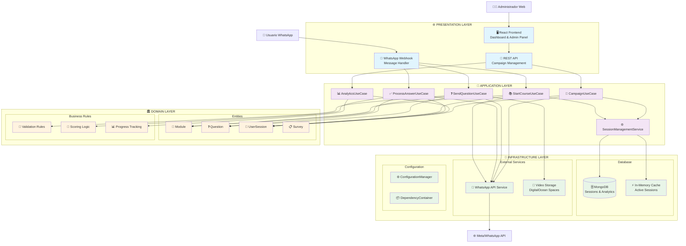
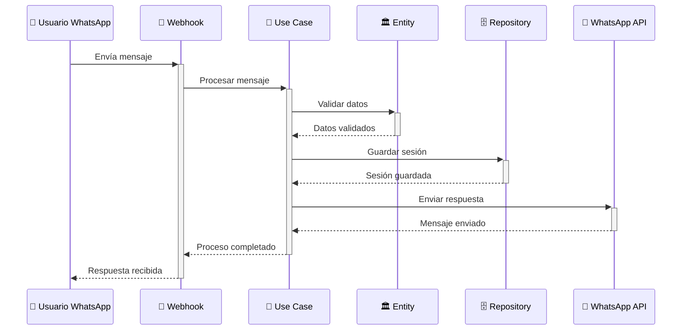
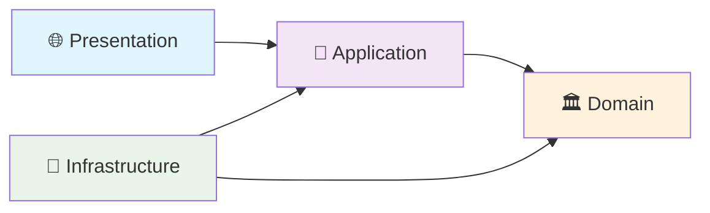
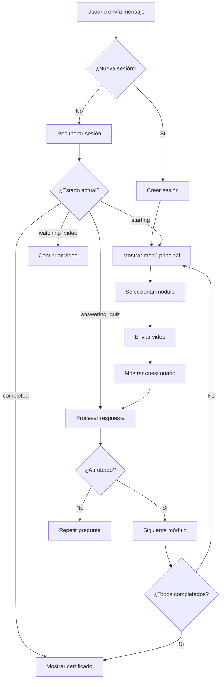
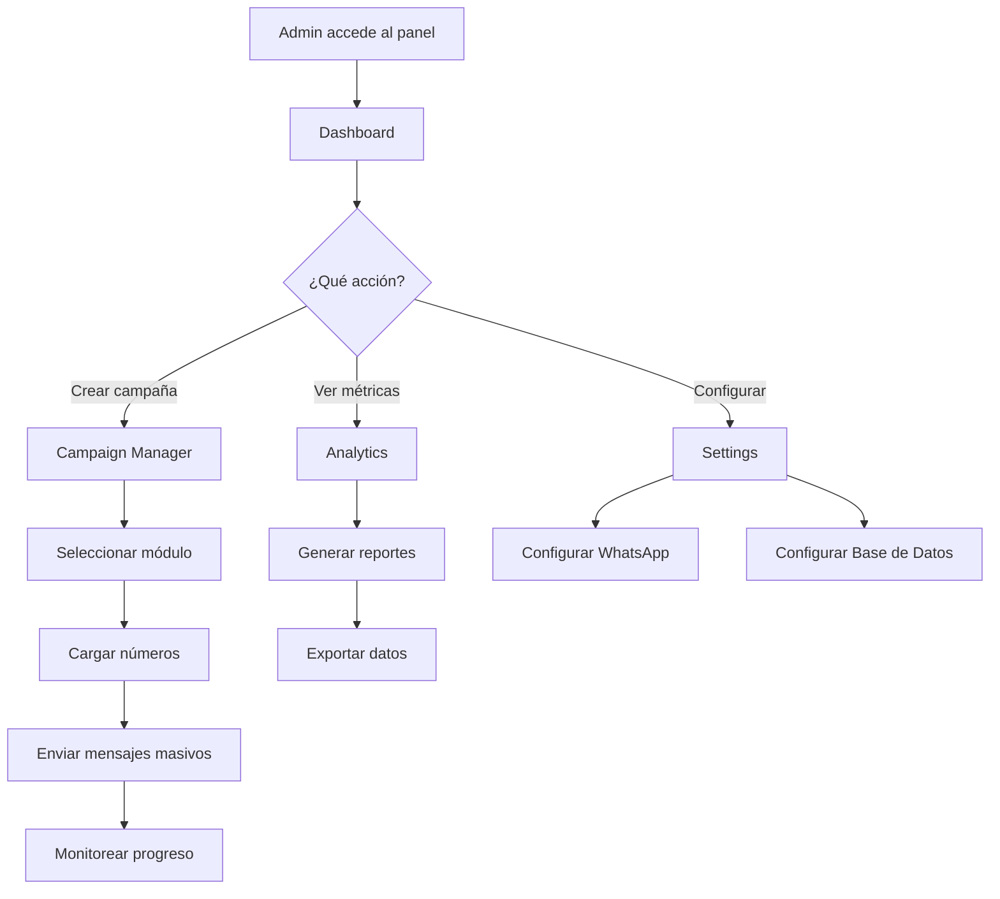

# 🏗️ Arquitectura del Sistema Niblion

## Diagrama de Arquitectura Clean



## Flujo de Datos Principal



## Estructura de Directorios Detallada

```
📁 Niblion/
├── 📁 backend/                    # 🎯 Backend Node.js
│   ├── 📁 src/
│   │   ├── 📁 domain/             # 🏛️ CAPA DE DOMINIO
│   │   │   └── 📁 entities/
│   │   │       ├── 📄 Module.js           # Módulo de capacitación
│   │   │       ├── 📄 Question.js         # Pregunta con validaciones
│   │   │       ├── 📄 UserSession.js      # Sesión de usuario
│   │   │       └── 📄 Survey.js           # Encuesta de feedback
│   │   │
│   │   ├── 📁 application/        # 🎯 CAPA DE APLICACIÓN
│   │   │   ├── 📁 use-cases/
│   │   │   │   ├── 📄 StartCourseUseCase.js     # Iniciar curso
│   │   │   │   ├── 📄 ProcessAnswerUseCase.js   # Procesar respuesta
│   │   │   │   └── 📄 SendQuestionUseCase.js    # Enviar pregunta
│   │   │   └── 📁 services/
│   │   │       └── 📄 SessionManagementService.js
│   │   │
│   │   ├── 📁 infrastructure/     # 🔧 CAPA DE INFRAESTRUCTURA
│   │   │   ├── 📁 database/
│   │   │   │   ├── 📄 DatabaseConnection.js     # Conexión MongoDB
│   │   │   │   └── 📄 MongoSessionRepository.js # Repo de sesiones
│   │   │   └── 📁 external/
│   │   │       └── 📄 WhatsAppApiService.js     # API WhatsApp
│   │   │
│   │   ├── 📁 presentation/       # 🌐 CAPA DE PRESENTACIÓN
│   │   │   ├── 📁 controllers/
│   │   │   │   ├── 📄 WhatsAppWebhookController.js
│   │   │   │   └── 📄 CourseApiController.js
│   │   │   └── 📁 routes/
│   │   │       ├── 📄 whatsappRoutes.js
│   │   │       └── 📄 courseApiRoutes.js
│   │   │
│   │   └── 📁 shared/             # ⚙️ CONFIGURACIÓN COMPARTIDA
│   │       ├── 📄 ConfigurationManager.js
│   │       └── 📄 DependencyContainer.js
│   │
│   ├── 📄 package.json
│   └── 📄 .env
│
├── 📁 frontend/                   # ⚛️ Frontend React
│   ├── 📁 src/
│   │   ├── 📁 components/
│   │   │   └── 📁 layout/
│   │   │       └── 📄 Navbar.jsx
│   │   ├── 📁 pages/
│   │   │   ├── 📄 Dashboard.jsx           # Dashboard principal
│   │   │   ├── 📄 CampaignManager.jsx     # Gestión de campañas
│   │   │   ├── 📄 Analytics.jsx           # Reportes y métricas
│   │   │   └── 📄 Settings.jsx            # Configuración
│   │   ├── 📄 App.jsx
│   │   └── 📄 main.jsx
│   │
│   ├── 📄 package.json
│   ├── 📄 tailwind.config.js
│   └── 📄 vite.config.js
│
├── 📁 simulations/               # 🔬 Módulo Gophis (pendiente)
│   └── 📄 (código de simulaciones)
│
├── 📄 README.md
├── 📄 package.json               # Monorepo principal
└── 📄 .gitignore
```

## Principios de Clean Architecture Aplicados

### 🎯 Regla de Dependencias


**Las dependencias fluyen hacia adentro:**
- 🌐 **Presentation** depende de **Application** 
- 🎯 **Application** depende de **Domain**
- 🔧 **Infrastructure** implementa interfaces de **Domain**
- 🏛️ **Domain** NO depende de nada externo

### 🏛️ Capa de Dominio (Domain)
**Responsabilidades:**
- ✅ Entidades de negocio puras
- ✅ Reglas de validación
- ✅ Lógica de scoring y progreso
- ❌ NO conoce bases de datos
- ❌ NO conoce frameworks externos

**Ejemplo de Entidad:**
```javascript
// UserSession.js - Entidad pura de dominio
export class UserSession {
  constructor(phoneNumber, moduleId) {
    this.phoneNumber = phoneNumber;
    this.moduleId = moduleId;
    this.currentState = 'starting';
    this.score = 0;
    this.answers = [];
  }
  
  // Lógica de negocio pura
  advanceToNextQuestion() { /* ... */ }
  calculateFinalScore() { /* ... */ }
  isModuleCompleted() { /* ... */ }
}
```

### 🎯 Capa de Aplicación (Application)
**Responsabilidades:**
- ✅ Casos de uso específicos
- ✅ Orquestación de entidades
- ✅ Coordinación de servicios
- ❌ NO contiene lógica de negocio
- ❌ NO maneja detalles técnicos

**Ejemplo de Caso de Uso:**
```javascript
// ProcessAnswerUseCase.js
export class ProcessAnswerUseCase {
  constructor(sessionRepository, whatsappService) {
    this.sessionRepository = sessionRepository;
    this.whatsappService = whatsappService;
  }
  
  async execute(phoneNumber, answer) {
    // 1. Obtener sesión
    const session = await this.sessionRepository.find(phoneNumber);
    
    // 2. Procesar respuesta (lógica de dominio)
    const result = session.processAnswer(answer);
    
    // 3. Guardar cambios
    await this.sessionRepository.save(session);
    
    // 4. Enviar feedback
    await this.whatsappService.sendMessage(phoneNumber, result.feedback);
    
    return result;
  }
}
```

### 🔧 Capa de Infraestructura (Infrastructure)
**Responsabilidades:**
- ✅ Implementación de repositorios
- ✅ Servicios externos (WhatsApp, MongoDB)
- ✅ Configuración y conexiones
- ✅ Detalles técnicos específicos

### 🌐 Capa de Presentación (Presentation)
**Responsabilidades:**
- ✅ Controladores HTTP
- ✅ Webhooks de WhatsApp
- ✅ Rutas y middleware
- ✅ Validación de entrada
- ✅ Formateo de respuestas

## Patrones de Diseño Implementados

### 📦 Dependency Injection
```javascript
// DependencyContainer.js
export class DependencyContainer {
  async initialize() {
    // Inyección de dependencias
    this.sessionRepository = new MongoSessionRepository(db);
    this.whatsappService = new WhatsAppApiService(config);
    this.processAnswerUseCase = new ProcessAnswerUseCase(
      this.sessionRepository,
      this.whatsappService
    );
  }
}
```

### 🏪 Repository Pattern
```javascript
// Interfaz implícita en JavaScript
class ISessionRepository {
  async find(phoneNumber) { throw new Error('Not implemented'); }
  async save(session) { throw new Error('Not implemented'); }
}

// Implementación concreta
export class MongoSessionRepository {
  async find(phoneNumber) {
    // Lógica específica de MongoDB
  }
  
  async save(session) {
    // Lógica específica de MongoDB
  }
}
```

### 🎭 Strategy Pattern
```javascript
// Para diferentes tipos de preguntas
class QuestionProcessor {
  process(question, answer) {
    switch(question.type) {
      case 'multiple_choice':
        return new MultipleChoiceStrategy().process(question, answer);
      case 'true_false':
        return new TrueFalseStrategy().process(question, answer);
    }
  }
}
```

## Ventajas de Esta Arquitectura

### ✅ **Mantenibilidad**
- Código organizado por responsabilidades
- Fácil localización de funcionalidades
- Cambios aislados por capas

### ✅ **Testabilidad**
- Lógica de negocio independiente
- Mocking fácil de dependencias
- Tests unitarios por capa

### ✅ **Escalabilidad**
- Adición de nuevos casos de uso
- Cambio de tecnologías sin afectar lógica
- Módulos independientes

### ✅ **Flexibilidad**
- Cambio de base de datos sin afectar dominio
- Integración con nuevas APIs
- Diferentes interfaces (Web, API, CLI)

## Flujo de Proceso de Negocio

### 📱 Flujo de WhatsApp


### 🌐 Flujo de Administración Web


Esta arquitectura garantiza que el sistema sea robusto, mantenible y escalable, siguiendo las mejores prácticas de desarrollo de software empresarial. 🚀